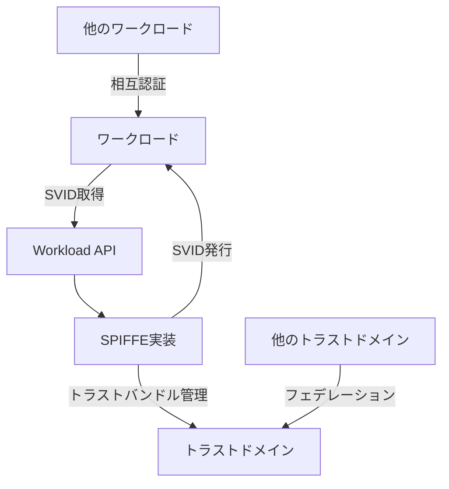
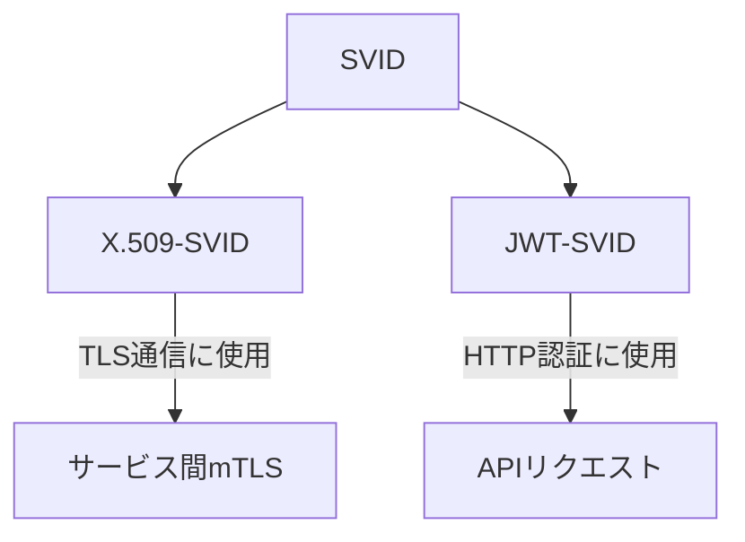

# SPIFFE日本語ドキュメント

このリポジトリは、[SPIFFE (Secure Production Identity Framework For Everyone)](https://spiffe.io/)の仕様と標準を日本語に翻訳したものです。

## 概要

SPIFFEは、クラウドネイティブおよびマイクロサービス環境におけるサービス間認証のための標準フレームワークです。このプロジェクトは、SPIFFEの仕様と標準を日本語で提供することで、日本語を話すエンジニアやセキュリティ専門家がSPIFFEを理解し、採用するのを支援することを目的としています。

## ドキュメント構成

このリポジトリは以下のセクションに分かれています：

### 概要

- [SPIFFE概要](overview/spiffe-overview.md) - SPIFFEフレームワークの概要と基本概念

### コア概念

- [SPIFFE ID](core-concepts/spiffe-id.md) - SPIFFE IDとSPIFFE検証可能アイデンティティドキュメント（SVID）の仕様
- [SPIFFE Trust Domain and Bundle](core-concepts/spiffe-trust-domain-and-bundle.md) - トラストドメインとバンドルの概念と仕様

### 認証文書

- [X.509 SVID](svid/x509-svid.md) - X.509証明書ベースのSVIDの仕様
- [JWT SVID](svid/jwt-svid.md) - JWT（JSON Web Token）ベースのSVIDの仕様

### API

- [SPIFFE Workload API](api/spiffe-workload-api.md) - ワークロードがSPIFFEアイデンティティを取得するためのAPI仕様

### フェデレーション

- [SPIFFE Federation](federation/spiffe-federation.md) - 異なるSPIFFEトラストドメイン間のフェデレーションの仕様

## SPIFFEアーキテクチャ図

以下は、SPIFFEアーキテクチャの概要を示す図です：



## SPIFFE ID構造

SPIFFE IDは以下の構造を持ちます：

```
spiffe://トラストドメイン/パス
```

例：
```
spiffe://example.com/service/database
```

## SVIDタイプ

SPIFFEは2種類のSVIDをサポートしています：



## 貢献

このプロジェクトへの貢献を歓迎します。翻訳の改善、ドキュメントの追加、または誤りの修正など、どのような形の貢献でも大歓迎です。

## ライセンス

このプロジェクトは、オリジナルのSPIFFE仕様と同じライセンスの下で提供されています。詳細については、[SPIFFEプロジェクト](https://github.com/spiffe/spiffe)を参照してください。
