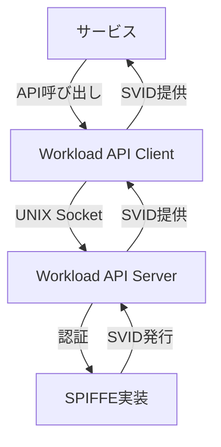

# SPIFFE Workload API

## このドキュメントの位置づけ

このドキュメントは、SPIFFE Workload APIの標準をインターネットコミュニティ向けに規定し、改善のための議論と提案を求めるものです。このドキュメントの配布に制限はありません。

## 要約

SPIFFE Workload APIは、ワークロード（サービス）がSPIFFEアイデンティティを取得し、他のサービスのアイデンティティを検証するためのAPIです。このドキュメントでは、Workload APIの設計、インターフェース、使用方法について詳細に説明します。

## 目次

- [SPIFFE Workload API](#spiffe-workload-api)
  - [このドキュメントの位置づけ](#このドキュメントの位置づけ)
  - [要約](#要約)
  - [目次](#目次)
  - [1. はじめに](#1-はじめに)
  - [2. Workload APIの概要](#2-workload-apiの概要)
    - [2.1 設計原則](#21-設計原則)
    - [2.2 アーキテクチャ](#22-アーキテクチャ)
    - [2.3 通信プロトコル](#23-通信プロトコル)
  - [3. Workload APIのインターフェース](#3-workload-apiのインターフェース)
    - [3.1 X.509-SVID取得](#31-x509-svid取得)
    - [3.2 JWT-SVID取得](#32-jwt-svid取得)
    - [3.3 バンドル取得](#33-バンドル取得)
    - [3.4 検証](#34-検証)
  - [4. ワークロード認証](#4-ワークロード認証)
    - [4.1 認証プロセス](#41-認証プロセス)
    - [4.2 セレクタ](#42-セレクタ)
  - [5. Workload APIの使用方法](#5-workload-apiの使用方法)
    - [5.1 クライアントライブラリ](#51-クライアントライブラリ)
    - [5.2 統合パターン](#52-統合パターン)
  - [6. セキュリティ考慮事項](#6-セキュリティ考慮事項)
  - [7. まとめ](#7-まとめ)

## 1. はじめに

SPIFFE Workload APIは、SPIFFEフレームワークの重要なコンポーネントです。このAPIは、ワークロード（サービス）がSPIFFEアイデンティティを取得し、他のサービスのアイデンティティを検証するための標準化されたインターフェースを提供します。

Workload APIは、サービスとSPIFFE実装（例：SPIRE）の間の橋渡しとして機能し、サービスがSPIFFEアイデンティティを簡単に利用できるようにします。

## 2. Workload APIの概要

### 2.1 設計原則

Workload APIは、以下の設計原則に基づいています：

- **シンプルさ**: サービスが簡単に統合できるシンプルなインターフェースを提供します。
- **セキュリティ**: 強力なセキュリティモデルを実装し、不正なアクセスからSPIFFEアイデンティティを保護します。
- **自動化**: SVIDの取得と更新を自動化し、サービスの運用負荷を軽減します。
- **プラットフォーム非依存**: さまざまなプラットフォームやランタイム環境で動作します。

### 2.2 アーキテクチャ

Workload APIのアーキテクチャは、以下のコンポーネントで構成されています：

1. **Workload API Server**: SPIFFE実装の一部として動作し、APIリクエストを処理します。
2. **Workload API Client**: サービスに組み込まれ、APIサーバーと通信します。
3. **認証メカニズム**: サービスのアイデンティティを検証するためのメカニズムです。

### 2.3 通信プロトコル

Workload APIは、gRPC（Google Remote Procedure Call）プロトコルを使用して実装されています。gRPCは、効率的なバイナリシリアライゼーションと双方向ストリーミングをサポートしています。

通信は、通常、UNIXドメインソケットを介して行われます。これにより、ローカルマシン上のプロセス間通信のセキュリティが確保されます。

## 3. Workload APIのインターフェース

### 3.1 X.509-SVID取得

`FetchX509SVID`メソッドは、サービスがX.509-SVIDを取得するために使用されます。このメソッドは、以下の情報を返します：

- X.509-SVID（証明書チェーンと秘密鍵）
- トラストバンドル（X.509証明書のセット）
- フェデレーションされたトラストドメインのバンドル（オプション）

このメソッドは、ストリーミングレスポンスを提供します。SVIDが更新されると、新しいSVIDがクライアントに自動的に送信されます。

### 3.2 JWT-SVID取得

`FetchJWTSVID`メソッドは、サービスがJWT-SVIDを取得するために使用されます。このメソッドは、以下のパラメータを受け取ります：

- オーディエンス（トークンの意図された受信者）
- 有効期限（オプション）

このメソッドは、指定されたオーディエンス向けのJWT-SVIDを返します。

### 3.3 バンドル取得

`FetchJWTBundles`メソッドは、サービスがJWKSバンドルを取得するために使用されます。このメソッドは、以下の情報を返します：

- トラストドメインのJWKSバンドル
- フェデレーションされたトラストドメインのJWKSバンドル（オプション）

このメソッドも、ストリーミングレスポンスを提供します。バンドルが更新されると、新しいバンドルがクライアントに自動的に送信されます。

### 3.4 検証

`ValidateJWTSVID`メソッドは、サービスがJWT-SVIDを検証するために使用されます。このメソッドは、以下のパラメータを受け取ります：

- JWT-SVID
- オーディエンス

このメソッドは、JWT-SVIDが有効であれば、そのSPIFFE IDを返します。

## 4. ワークロード認証

### 4.1 認証プロセス

Workload APIは、サービスを認証するために、プロセスの属性（例：PID、ユーザーID、コンテナID）を使用します。この認証プロセスは、以下の手順で行われます：

1. サービスがWorkload APIにリクエストを送信します。
2. Workload API Serverは、リクエスト元のプロセスの属性を収集します。
3. 収集された属性は、登録されたセレクタと照合されます。
4. 一致するセレクタが見つかると、対応するSPIFFE IDが決定されます。
5. 決定されたSPIFFE IDに基づいて、SVIDが発行されます。

### 4.2 セレクタ

セレクタは、サービスを識別するための属性です。セレクタの例としては、以下のようなものがあります：

- **UNIX**: ユーザーID、グループID、パス
- **Kubernetes**: 名前空間、サービスアカウント、ポッド名
- **Docker**: イメージID、コンテナラベル

セレクタは、SPIFFE実装の管理者によって設定されます。

## 5. Workload APIの使用方法

### 5.1 クライアントライブラリ

Workload APIを簡単に使用するために、さまざまな言語のクライアントライブラリが提供されています：

- **Go**: github.com/spiffe/go-spiffe
- **C++**: github.com/spiffe/cpp-spiffe
- **Java**: github.com/spiffe/java-spiffe
- **Python**: github.com/spiffe/python-spiffe

これらのライブラリは、Workload APIとの通信を抽象化し、SVIDの取得と更新を自動化します。

### 5.2 統合パターン

Workload APIは、以下のような統合パターンで使用されます：

1. **直接統合**: サービスがWorkload APIクライアントライブラリを直接使用します。
2. **サイドカー統合**: サイドカープロセスがWorkload APIと通信し、SVIDをサービスに提供します。
3. **プロキシ統合**: プロキシがWorkload APIと通信し、サービス間の通信を保護します。

## 6. セキュリティ考慮事項

Workload APIを使用する際には、以下のセキュリティ考慮事項に注意する必要があります：

- **ソケットのアクセス制御**: Workload APIソケットは、適切なアクセス制御で保護する必要があります。
- **認証の強度**: ワークロード認証メカニズムは、環境に応じて適切に設定する必要があります。
- **秘密鍵の保護**: SVIDの秘密鍵は、メモリ内でのみ保持し、ディスクに書き込まないようにします。
- **最小権限の原則**: サービスには、必要最小限のSPIFFE IDとアクセス権のみを付与します。

## 7. まとめ

SPIFFE Workload APIは、サービスがSPIFFEアイデンティティを取得し、他のサービスのアイデンティティを検証するための標準化されたインターフェースを提供します。このAPIは、SVIDの取得と更新を自動化し、サービス間の安全な通信を実現します。

Workload APIは、さまざまな言語のクライアントライブラリを通じて簡単に使用でき、異なる統合パターンをサポートしています。適切なセキュリティ対策を講じることで、Workload APIを安全に使用できます。
