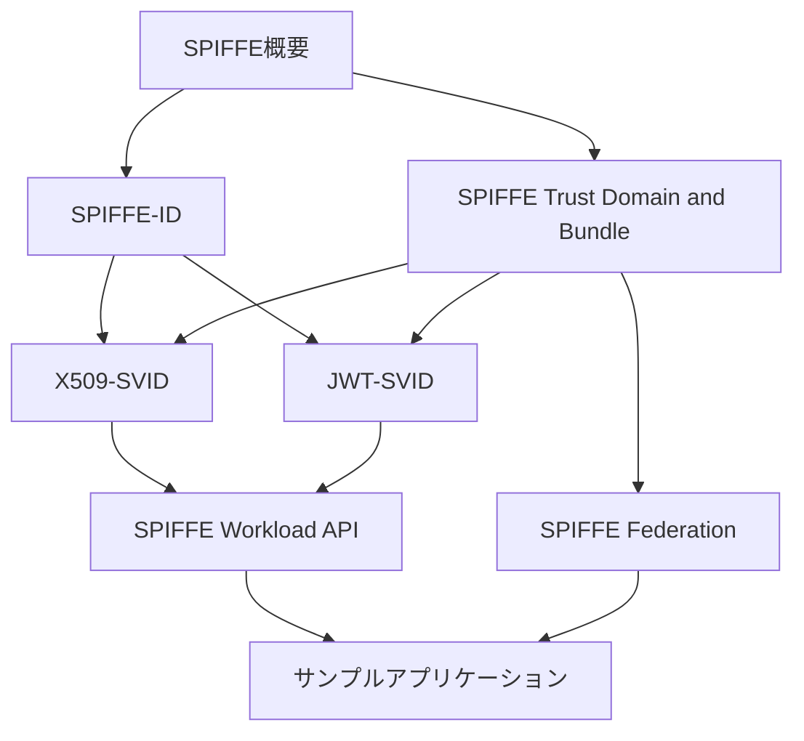

# SPIFFE日本語ドキュメント構成

このドキュメントでは、SPIFFE日本語ドキュメントの全体構成と各ファイルの概要を説明します。

## ディレクトリ構造

```
docs-ja/
├── README.md                      # プロジェクト概要
├── document-structure.md          # このファイル
├── overview/
│   └── spiffe-overview.md         # SPIFFEフレームワークの概要
├── core-concepts/
│   ├── spiffe-id.md               # SPIFFE IDの仕様
│   └── spiffe-trust-domain-and-bundle.md  # トラストドメインとバンドルの仕様
├── svid/
│   ├── x509-svid.md               # X.509-SVIDの仕様
│   └── jwt-svid.md                # JWT-SVIDの仕様
├── api/
│   └── spiffe-workload-api.md     # ワークロードAPIの仕様
├── federation/
│   └── spiffe-federation.md       # フェデレーションの仕様
└── examples/
    ├── spiffe-demo/               # Goによるサンプルアプリケーション
    │   ├── main.go
    │   ├── go.mod
    │   └── README.md
    └── k8s/                       # Kubernetes上での実装サンプル
        ├── spire-server.yaml
        ├── spire-agent.yaml
        ├── spiffe-demo.yaml
        ├── setup-kind.sh
        ├── cleanup.sh
        └── README.md
```

## 各ドキュメントの概要

### 1. 概要

#### [SPIFFE概要](overview/spiffe-overview.md)
SPIFFEフレームワークの基本概念、アーキテクチャ、ユースケースなどを説明しています。SPIFFEを初めて学ぶ方は、まずこのドキュメントを読むことをお勧めします。

### 2. コア概念

#### [SPIFFE ID](core-concepts/spiffe-id.md)
SPIFFE IDの形式、構造、使用方法について詳細に説明しています。SPIFFE IDは、サービスを一意に識別するための標準化された形式です。

#### [SPIFFE Trust Domain and Bundle](core-concepts/spiffe-trust-domain-and-bundle.md)
トラストドメインとバンドルの概念、構造、管理方法について説明しています。トラストドメインは、SPIFFE IDが発行される信頼領域であり、バンドルはそのドメイン内で発行されたSVIDを検証するための暗号鍵のセットです。

### 3. 認証文書

#### [X509-SVID](svid/x509-svid.md)
X.509証明書ベースのSPIFFE検証可能アイデンティティドキュメント（SVID）の仕様を説明しています。X.509-SVIDは、TLS通信などのトランスポート層のセキュリティに使用されます。

#### [JWT-SVID](svid/jwt-svid.md)
JSON Web Token（JWT）ベースのSPIFFE検証可能アイデンティティドキュメント（SVID）の仕様を説明しています。JWT-SVIDは、HTTPリクエストなどのアプリケーション層の認証に使用されます。

### 4. API

#### [SPIFFE Workload API](api/spiffe-workload-api.md)
ワークロード（サービス）がSPIFFEアイデンティティを取得し、他のサービスのアイデンティティを検証するためのAPIの仕様を説明しています。

### 5. フェデレーション

#### [SPIFFE Federation](federation/spiffe-federation.md)
異なるSPIFFEトラストドメイン間でのフェデレーション（相互認証）の仕様を説明しています。フェデレーションにより、異なる組織や環境に属するサービスが安全に通信できるようになります。

### 6. サンプル

#### spiffe-demo
Goで実装されたSPIFFE認証のサンプルアプリケーションです。サーバーとクライアントの両方のコンポーネントが含まれており、SPIREを使用してX.509-SVIDベースの相互TLS（mTLS）認証を実装しています。

#### k8s
Kubernetes上でSPIFFE/SPIREを使用したサービス間認証のサンプル実装です。SPIREサーバー、SPIREエージェント、サンプルアプリケーションのデプロイメント設定が含まれています。

## ドキュメント間の関連性



## 学習パス

SPIFFEを効果的に学ぶための推奨学習パスは以下の通りです：

1. [SPIFFE概要](overview/spiffe-overview.md) - 基本概念とアーキテクチャを理解する
2. [SPIFFE ID](core-concepts/spiffe-id.md) - SPIFFE IDの形式と使用方法を学ぶ
3. [SPIFFE Trust Domain and Bundle](core-concepts/spiffe-trust-domain-and-bundle.md) - トラストドメインとバンドルの概念を理解する
4. [X509-SVID](svid/x509-svid.md)と[JWT-SVID](svid/jwt-svid.md) - 認証文書の形式と使用方法を学ぶ
5. [SPIFFE Workload API](api/spiffe-workload-api.md) - ワークロードAPIの使用方法を理解する
6. [SPIFFE Federation](federation/spiffe-federation.md) - フェデレーションの概念と実装方法を学ぶ
7. サンプルアプリケーション - 実際の実装例を通じてSPIFFEの使用方法を理解する

## 貢献

このドキュメントプロジェクトへの貢献を歓迎します。翻訳の改善、ドキュメントの追加、または誤りの修正など、どのような形の貢献でも大歓迎です。
