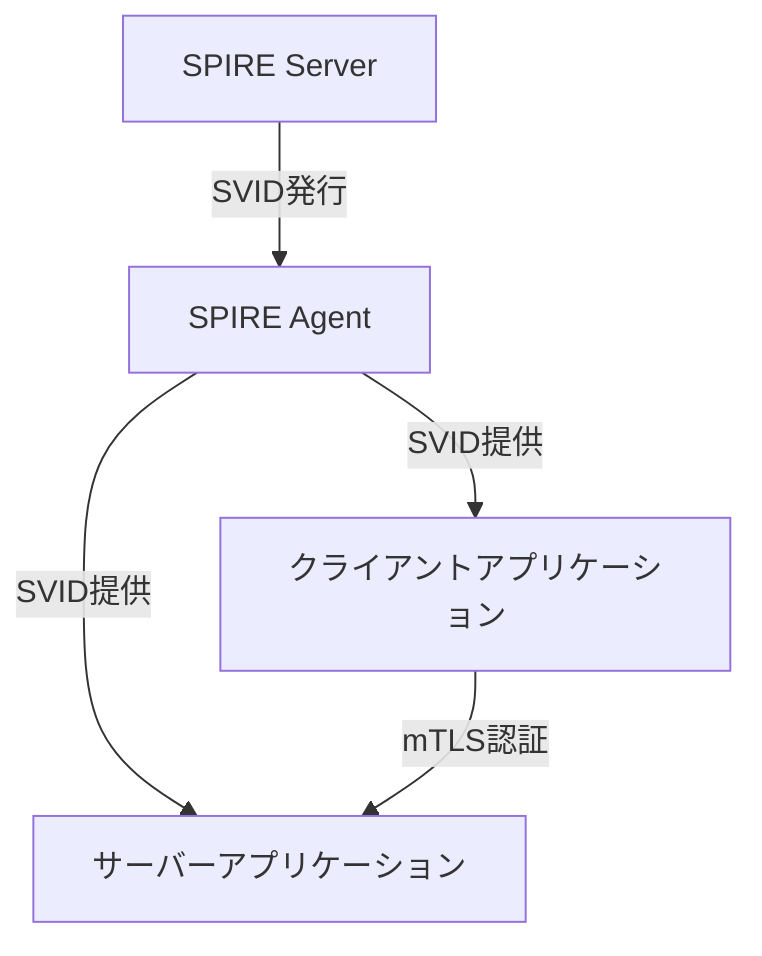

# Kubernetes上でのSPIFFE/SPIRE実装サンプル

このディレクトリには、Kubernetes上でSPIFFE/SPIREを使用したサービス間認証のサンプル実装が含まれています。

## 概要

このサンプルは以下のコンポーネントで構成されています：

1. **SPIRE Server**: SPIFFE IDの発行と管理を担当するサーバー
2. **SPIRE Agent**: ワークロードにSPIFFE IDを提供するエージェント
3. **サンプルアプリケーション**: SPIFFE認証を使用したサーバーとクライアント

## 前提条件

- Kubernetes クラスター（minikube、kind、またはその他のKubernetesクラスター）
- kubectl コマンドラインツール

## セットアップ手順

### 1. SPIREサーバーのデプロイ

```bash
kubectl apply -f spire-server.yaml
```

SPIREサーバーが起動するまで待ちます：

```bash
kubectl -n spire wait --for=condition=Ready pod -l app=spire-server --timeout=60s
```

### 2. SPIREエージェントのデプロイ

```bash
kubectl apply -f spire-agent.yaml
```

SPIREエージェントが起動するまで待ちます：

```bash
kubectl -n spire wait --for=condition=Ready pod -l app=spire-agent --timeout=60s
```

### 3. サンプルアプリケーションのデプロイ

```bash
kubectl apply -f spiffe-demo.yaml
```

## 動作確認

### ログの確認

サーバーとクライアントのログを確認して、SPIFFE認証が正常に機能していることを確認します：

```bash
# サーバーのログを確認
kubectl -n spiffe-demo logs -l app=spiffe-demo-server

# クライアントのログを確認
kubectl -n spiffe-demo logs -l app=spiffe-demo-client
```

正常に動作している場合、以下のようなログが表示されます：

**サーバーログ**:
```
Server SPIFFE ID: spiffe://example.org/server
Server started: https://spiffe-demo-server:8443
Received request from client: spiffe://example.org/client
```

**クライアントログ**:
```
Client SPIFFE ID: spiffe://example.org/client
Response from server: Hello, spiffe://example.org/client! The current time is 2023-08-28T12:34:56Z.
```

## アーキテクチャ



## SPIFFE IDの登録

このサンプルでは、以下のSPIFFE IDが登録されています：

- サーバー: `spiffe://example.org/server`
- クライアント: `spiffe://example.org/client`

登録は`spire-registration`ジョブによって自動的に行われます。

## 相互TLS（mTLS）認証

サンプルアプリケーションは、SPIFFE IDを使用した相互TLS（mTLS）認証を実装しています：

1. サーバーとクライアントは、SPIREエージェントからX.509-SVIDを取得します。
2. サーバーは、任意のクライアントからの接続を受け入れますが、クライアントのSPIFFE IDをログに記録します。
3. クライアントは、サーバーのSPIFFE IDが`spiffe://example.org/server`であることを検証します。

## クリーンアップ

```bash
kubectl delete -f spiffe-demo.yaml
kubectl delete -f spire-agent.yaml
kubectl delete -f spire-server.yaml
```

## 注意事項

- このサンプルは教育目的であり、本番環境での使用は推奨されません。
- 実際のデプロイメントでは、適切なセキュリティ対策を実装する必要があります。
- SPIREサーバーは、高可用性構成で実行することをお勧めします。

## 参考リソース

- [SPIFFE公式ドキュメント](https://spiffe.io/docs/)
- [SPIRE Kubernetes構成ガイド](https://spiffe.io/docs/latest/deploying/spire_on_kubernetes/)
- [go-spiffe ライブラリ](https://github.com/spiffe/go-spiffe)
