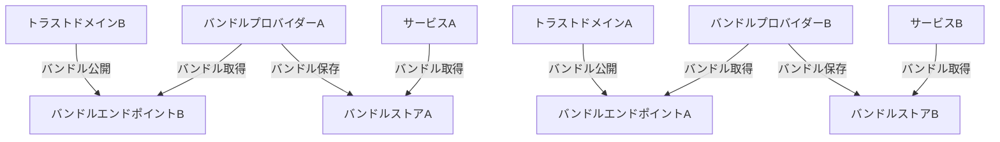

# SPIFFE フェデレーション

## このドキュメントの位置づけ

このドキュメントは、SPIFFEフェデレーションの標準をインターネットコミュニティ向けに規定し、改善のための議論と提案を求めるものです。このドキュメントの配布に制限はありません。

## 要約

SPIFFEフェデレーションは、異なるSPIFFEトラストドメイン間で信頼関係を確立するためのメカニズムです。このドキュメントでは、フェデレーションの概念、アーキテクチャ、実装方法について詳細に説明します。

## 目次

- [SPIFFE フェデレーション](#spiffe-フェデレーション)
  - [このドキュメントの位置づけ](#このドキュメントの位置づけ)
  - [要約](#要約)
  - [目次](#目次)
  - [1. はじめに](#1-はじめに)
  - [2. フェデレーションの概要](#2-フェデレーションの概要)
    - [2.1 フェデレーションの定義](#21-フェデレーションの定義)
    - [2.2 フェデレーションのユースケース](#22-フェデレーションのユースケース)
    - [2.3 フェデレーションのアーキテクチャ](#23-フェデレーションのアーキテクチャ)
  - [3. バンドルの交換](#3-バンドルの交換)
    - [3.1 バンドル交換プロトコル](#31-バンドル交換プロトコル)
    - [3.2 バンドルの形式](#32-バンドルの形式)
    - [3.3 バンドルの更新](#33-バンドルの更新)
  - [4. フェデレーションの確立](#4-フェデレーションの確立)
    - [4.1 エンドポイント発見](#41-エンドポイント発見)
    - [4.2 認証と認可](#42-認証と認可)
    - [4.3 信頼関係の確立](#43-信頼関係の確立)
  - [5. フェデレーションの使用](#5-フェデレーションの使用)
    - [5.1 クロスドメイン認証](#51-クロスドメイン認証)
    - [5.2 アクセス制御](#52-アクセス制御)
  - [6. セキュリティ考慮事項](#6-セキュリティ考慮事項)
  - [7. まとめ](#7-まとめ)

## 1. はじめに

現代の分散システムでは、異なる組織や環境にまたがるサービス間の通信が一般的です。SPIFFEフェデレーションは、異なるSPIFFEトラストドメイン間で信頼関係を確立し、これらのサービスが安全に通信できるようにするためのメカニズムを提供します。

フェデレーションにより、組織は自身のアイデンティティ管理を維持しながら、他の組織のサービスと安全に通信できるようになります。

## 2. フェデレーションの概要

### 2.1 フェデレーションの定義

SPIFFEフェデレーションは、異なるSPIFFEトラストドメイン間で信頼関係を確立するプロセスです。フェデレーションにより、あるトラストドメインのサービスが別のトラストドメインのサービスのSVIDを検証できるようになります。

フェデレーションは、トラストドメイン間でバンドル（公開鍵のセット）を交換することで実現されます。

### 2.2 フェデレーションのユースケース

フェデレーションは、以下のようなユースケースで有用です：

- **マルチクラウド環境**: 異なるクラウドプロバイダー上で実行されるサービス間の通信
- **組織間連携**: 異なる組織のサービス間の通信
- **マルチクラスター環境**: 異なるKubernetesクラスター間のサービス通信
- **ハイブリッドクラウド**: オンプレミス環境とクラウド環境間のサービス通信

### 2.3 フェデレーションのアーキテクチャ

SPIFFEフェデレーションのアーキテクチャは、以下のコンポーネントで構成されています：

1. **バンドルエンドポイント**: トラストドメインのバンドルを公開するエンドポイント
2. **バンドルプロバイダー**: 他のトラストドメインからバンドルを取得するコンポーネント
3. **バンドルストア**: 取得したバンドルを保存するストレージ

## 3. バンドルの交換

### 3.1 バンドル交換プロトコル

バンドル交換は、以下のプロトコルを使用して行われます：

1. **HTTPS**: バンドルは、HTTPSエンドポイントを介して公開されます。
2. **SPIFFE Federation API**: SPIFFEフェデレーションAPIを使用して、バンドルを取得します。

バンドル交換プロトコルは、以下の手順で実行されます：

1. バンドルプロバイダーは、バンドルエンドポイントにリクエストを送信します。
2. バンドルエンドポイントは、リクエスト元を認証し、認可します。
3. 認証と認可が成功すると、バンドルエンドポイントはバンドルを返します。
4. バンドルプロバイダーは、受け取ったバンドルを検証し、バンドルストアに保存します。

### 3.2 バンドルの形式

バンドルは、以下の2つの形式で交換されます：

1. **X.509バンドル**: X.509証明書のセットとして表現されます。これは、X.509-SVIDの検証に使用されます。
2. **JWKSバンドル**: JSON Web Key Set（JWKS）として表現されます。これは、JWT-SVIDの検証に使用されます。

バンドルは、JSON形式でエンコードされ、以下の情報を含みます：

- トラストドメイン名
- 公開鍵のセット
- メタデータ（有効期限、発行者など）

### 3.3 バンドルの更新

バンドルは、以下のような理由で定期的に更新されます：

- 鍵のローテーション
- 鍵の失効
- セキュリティポリシーの変更

バンドルの更新は、以下の方法で処理されます：

1. **ポーリング**: バンドルプロバイダーは、定期的にバンドルエンドポイントをポーリングして、更新を確認します。
2. **プッシュ通知**: バンドルエンドポイントは、更新があった場合に、登録されたバンドルプロバイダーに通知します。

## 4. フェデレーションの確立

### 4.1 エンドポイント発見

フェデレーションを確立するには、まず、トラストドメインのバンドルエンドポイントを発見する必要があります。エンドポイント発見は、以下の方法で行われます：

1. **手動設定**: バンドルエンドポイントのURLを手動で設定します。
2. **DNS-based Service Discovery**: DNSレコードを使用して、バンドルエンドポイントを発見します。
3. **SPIFFE Federation API**: SPIFFEフェデレーションAPIを使用して、バンドルエンドポイントを発見します。

### 4.2 認証と認可

バンドルエンドポイントは、リクエスト元を認証し、認可する必要があります。認証と認可は、以下の方法で行われます：

1. **mTLS**: 相互TLS（mTLS）を使用して、リクエスト元を認証します。
2. **APIキー**: APIキーを使用して、リクエスト元を認証します。
3. **OAuth/OIDC**: OAuth/OIDCを使用して、リクエスト元を認証します。

認証と認可のポリシーは、トラストドメインの管理者によって設定されます。

### 4.3 信頼関係の確立

信頼関係の確立は、以下の手順で行われます：

1. トラストドメインAとトラストドメインBの管理者は、フェデレーションを確立することに合意します。
2. 両方のトラストドメインは、バンドルエンドポイントを設定し、公開します。
3. トラストドメインAは、トラストドメインBのバンドルエンドポイントからバンドルを取得します。
4. トラストドメインBは、トラストドメインAのバンドルエンドポイントからバンドルを取得します。
5. 両方のトラストドメインは、取得したバンドルを検証し、バンドルストアに保存します。

信頼関係が確立されると、トラストドメインAのサービスはトラストドメインBのサービスのSVIDを検証でき、その逆も可能になります。

## 5. フェデレーションの使用

### 5.1 クロスドメイン認証

フェデレーションが確立されると、異なるトラストドメインのサービス間でクロスドメイン認証が可能になります。クロスドメイン認証は、以下の手順で行われます：

1. サービスAは、トラストドメインAからSVIDを取得します。
2. サービスAは、サービスBにリクエストを送信し、SVIDを提示します。
3. サービスBは、サービスAのSVIDを検証します。この際、トラストドメインAのバンドルを使用します。
4. 検証が成功すると、サービスBはサービスAのアイデンティティを信頼し、リクエストを処理します。

### 5.2 アクセス制御

クロスドメイン認証に加えて、フェデレーションはアクセス制御にも使用されます。サービスは、リクエスト元のSPIFFE IDに基づいて、リクエストを許可するかどうかを決定できます。

例えば、サービスBは、特定のSPIFFE IDを持つサービスAからのリクエストのみを許可するポリシーを実装できます。

## 6. セキュリティ考慮事項

SPIFFEフェデレーションを使用する際には、以下のセキュリティ考慮事項に注意する必要があります：

- **バンドルの整合性**: バンドルは、改ざんから保護する必要があります。バンドルが改ざんされると、不正なSVIDが検証される可能性があります。
- **エンドポイントのセキュリティ**: バンドルエンドポイントは、適切なセキュリティ対策で保護する必要があります。
- **認証と認可**: バンドルエンドポイントへのアクセスは、適切な認証と認可で制御する必要があります。
- **鍵の管理**: トラストドメインの鍵は、適切に管理し、定期的にローテーションする必要があります。
- **信頼の範囲**: フェデレーションは、必要最小限のトラストドメインとのみ確立する必要があります。

## 7. まとめ

SPIFFEフェデレーションは、異なるSPIFFEトラストドメイン間で信頼関係を確立するためのメカニズムを提供します。フェデレーションにより、異なる組織や環境にまたがるサービスが安全に通信できるようになります。

フェデレーションは、バンドルの交換によって実現され、クロスドメイン認証とアクセス制御を可能にします。適切なセキュリティ対策を講じることで、フェデレーションを安全に使用できます。
